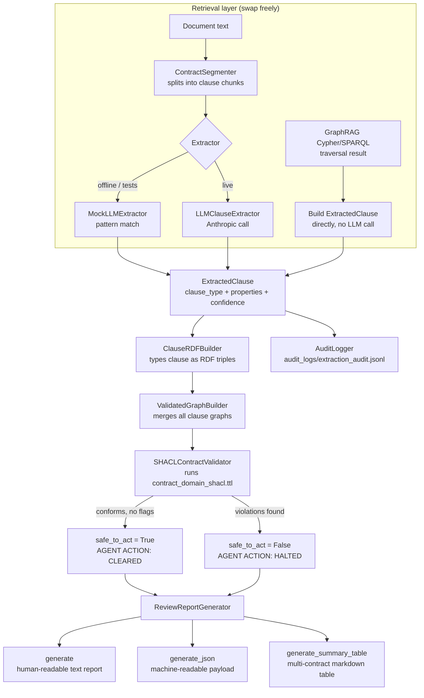

# ontology-rag-firewall

OWL/SHACL validation layer for LLM-extracted enterprise documents — because your RAG pipeline doesn't know what a liability clause means.

  

RAG pipelines retrieve text. They do not validate meaning.  
GraphRAG retrieves *facts* — typed, relationship-aware, negation-safe — and still does not validate meaning.  
A 98% uptime SLA with no remedy is not an SLA.  
A liability cap at 3 months' fees on a $2.3M contract is a material risk.  
Neither your vector store nor your knowledge graph can tell you that. The ontology can.

## The Key Insight

```text
RAG and GraphRAG handle retrieval (GraphRAG handles it better).
Ontology handles reasoning.
Both are necessary.
Only one ships by default.
```

See [`docs/graphrag_vs_shacl.md`](docs/graphrag_vs_shacl.md) for the full
RAG vs GraphRAG vs GraphRAG+SHACL breakdown, and
[`examples/demo_graphrag_integration.py`](examples/demo_graphrag_integration.py)
for this same firewall validating a mocked GraphRAG (Cypher-traversal-style)
result instead of LLM-extracted document text.

## Architecture

```text
Document -> [Vector Store  -OR-  Knowledge Graph] -> Structured Facts -> SHACL Validate -> Ontology Graph -> Agent
```

This firewall is retrieval-architecture-agnostic: it validates structured
facts regardless of whether they came from vector similarity search (RAG),
Cypher/SPARQL graph traversal (GraphRAG), or direct LLM extraction.

## How It Works



Two things worth calling out in this diagram:

1. **The retrieval layer is swappable.** Whether facts arrive from
   segmented document text (RAG path, top) or a GraphRAG traversal (bottom),
   both funnel into the same `ExtractedClause` shape before hitting the
   SHACL gate. See [`docs/graphrag_vs_shacl.md`](docs/graphrag_vs_shacl.md).
2. **The SHACL gate is the only thing that decides `safe_to_act`.**
   Extraction confidence, clause count, and page numbers are metadata — none
   of them clear a contract on their own.

## Inputs and Outputs

### Entry point

```python
from ontology_rag_firewall.pipeline.firewall import OntologyRAGFirewall

result = OntologyRAGFirewall(extractor=MockLLMExtractor()).process(
    document_text="... full contract text ...",
    document_id="MSSA-2026-047",
    contract_value=2_300_000,
)
```

| Input | Type | Description |
|---|---|---|
| `document_text` | `str` | Raw contract text. Segmented into clause chunks by `ContractSegmenter`. |
| `document_id` | `str` | Your identifier for the contract; propagated into clause IDs and audit log rows. |
| `contract_value` | `float` | Total contract value, used by ratio-based SHACL rules (`LiabilityCapRatio`, `HighValueLowCap`). |
| `extractor` (constructor arg) | `MockLLMExtractor` \| `LLMClauseExtractor` \| custom | Anything exposing `.extract(clause_text, clause_id, page, contract_value) -> ExtractedClause`. This is the swap point for RAG vs. GraphRAG vs. live LLM — see `examples/demo_graphrag_integration.py` for a GraphRAG-sourced extractor that skips text extraction entirely. |

### Output: `ExtractionResult`

| Field | Type | Description |
|---|---|---|
| `document_id` | `str` | Echoed from input. |
| `document_type` | `str` | Currently always `"contract"`. |
| `total_clauses` | `int` | Number of segmented/extracted clauses. |
| `validated_clauses` | `list[ExtractedClause]` | Clauses with no attributed SHACL violations. |
| `flagged_clauses` | `list[ExtractedClause]` | Clauses with at least one attributed violation (warning or critical). |
| `critical_flags` | `list[ExtractedClause]` | Subset of `flagged_clauses` at `🚨` severity. |
| `ontology_graph` | `rdflib.Graph` | The merged RDF graph submitted to SHACL — inspectable/queryable directly. |
| `safe_to_act` | `bool` | `True` only if the graph conforms **and** nothing was flagged. This is the one field an agent should gate on. |
| `processing_time_seconds` | `float` | Wall-clock time for the full segment → extract → validate pass. |
| `total_value_at_risk` | `float` | `contract_value` if anything was flagged, else `0.0`. |

Each `ExtractedClause` carries: `clause_id`, `clause_type`, `raw_text`, `extracted_properties` (dict), `confidence` (float), `page_number`, `requires_review` (bool), `violations` (list of SHACL messages attributed to it), `severity` (`"none"` / `"warning"` / `"critical"`).

### Report formats (`ReviewReportGenerator`)

| Method | Returns | Use case |
|---|---|---|
| `.generate(result)` | `str` | Human-readable report for legal/procurement review queues (see sample output below). |
| `.generate_json(result)` | `dict` | Machine-readable payload for dashboards/APIs: `document_id`, `safe_to_act`, `total_clauses`, `validated`, `flagged`. |
| `.generate_summary_table(results)` | `str` (markdown table) | One row per contract, for batch runs — see `examples/demo_batch_processing.py`. |

### Sample output (`python examples/demo_offline.py`, verified)

```text
=== ONTOLOGY RAG FIREWALL REVIEW REPORT ===
Document ID: mssa-2p3m
Processing time (s): 0.12
Safe to act: 🚫 NO

Statistics:
- Total clauses: 8
- Validated: 3
- Flagged: 5
- Critical: 0

Warning flags (⚠️):
- mssa-2p3m-2: ⚠️ FINANCE REVIEW: Payment terms exceed 60 days. Cash flow impact requires approval.
- mssa-2p3m-3: ⚠️ SLA RISK: No enforceable remedy specified. 'Commercially reasonable efforts' is not an SLA.
- mssa-2p3m-3: ⚠️ SLA RISK: Uptime commitment below 99.5%. Business continuity review required.
- mssa-2p3m-4: ⚠️ AUTO-RENEWAL RISK: Contract auto-renews with less than 60-day cancellation window.
- mssa-2p3m-4: ⚠️ LEGAL RISK: Termination notice period is less than 30 days. Review required.
- mssa-2p3m-5: ⚠️ LEGAL REVIEW: DirectDamagesOnly scope detected. Consequential losses excluded. Verify risk acceptance.
- mssa-2p3m-5: ⚠️ LOW CONFIDENCE: Extraction confidence below threshold. Human verification required.

Recommended actions:
AGENT ACTION: HALTED. Routed to human review queue.
```

The equivalent `generate_json(result)` payload:

```json
{
  "document_id": "mssa-2p3m",
  "safe_to_act": false,
  "total_clauses": 8,
  "validated": ["mssa-2p3m-1", "mssa-2p3m-7", "mssa-2p3m-8"],
  "flagged": [
    {"id": "mssa-2p3m-2", "violations": ["⚠️ FINANCE REVIEW: ..."], "severity": "warning"},
    {"id": "mssa-2p3m-5", "violations": ["⚠️ LEGAL REVIEW: ...", "⚠️ LOW CONFIDENCE: ..."], "severity": "warning"}
  ]
}
```

### Side effect: audit log

Every processed clause is appended as one JSON line to `audit_logs/extraction_audit.jsonl` (`AuditLogger`), with `timestamp`, `document_id`, `clause_id`, `clause_type`, `confidence`, `requires_review`, `violations`, `severity` — a complete, replayable audit trail independent of the in-memory `ExtractionResult`.

## Documentation

- Architecture: `docs/architecture.md`
- SHACL rules in plain English: `docs/shacl_rules.md`
- Extension guide: `docs/extending.md`
- RAG vs ontology guidance: `docs/rag_vs_ontology.md`
- RAG vs GraphRAG vs GraphRAG+SHACL: `docs/graphrag_vs_shacl.md`

## Quick Start

```bash
# Path 1: Offline demo (no API key needed — start here)
git clone https://github.com/cloudbadal007/ontology-rag-firewall
cd ontology-rag-firewall
pip install -r requirements.txt
python examples/demo_offline.py

# Path 2: Live LLM extraction (requires Anthropic API key)
cp .env.example .env
# Add your ANTHROPIC_API_KEY to .env
python examples/demo_contract_extraction.py

# Path 3: GraphRAG integration (no API key needed — same firewall, graph-sourced facts)
python examples/demo_graphrag_integration.py
```

## SHACL Rules

| Rule | Triggers When | Severity |
|---|---|---|
| LiabilityCapRatio | Cap < 10% of contract value | Warning |
| DirectDamagesReview | DirectDamagesOnly scope and no review flag | Warning |
| PaymentTerm | Payment term > 60 days | Warning |
| TerminationNotice | Notice period < 30 days | Warning |
| SLACommitment | Uptime < 99.5% | Warning |
| LowConfidenceExtraction | Confidence < 0.75 | Warning |
| NoRemedySLA | Remedy = NoRemedy | Warning |
| AutoRenewalFlag | Auto-renew + notice < 60 days | Warning |
| MissingLiabilityClause | No liability clause extracted | Violation |
| HighValueLowCap | Contract > $1M and cap < $100K | Violation |

## The Embedding Blindness Problem

```text
"The vendor shall NOT be liable for consequential damages"
"The vendor shall be liable for consequential damages"
Cosine similarity: 0.9147
```

## Related Articles

- [Your RAG Pipeline Is Lying to You](https://medium.com/@cloudpankaj)
- [Ontology Firewall Patterns for Enterprise AI](https://medium.com/@cloudpankaj)
- [Why SHACL Is the Missing Layer](https://medium.com/@cloudpankaj)
- [From Vector Search to Semantic Governance](https://medium.com/@cloudpankaj)
- [Designing Agent-Safe Knowledge Graphs](https://medium.com/@cloudpankaj)

## Testing

```bash
pytest tests -q
```

16 tests across 5 files. Every scenario below is a real, currently-passing
test — not aspirational coverage.

### SHACL rule scenarios (`tests/test_shacl_constraints.py`)

Each rule is tested both ways: the input that should trigger it, and the
inverse input that should conform.

| # | Scenario | Sample input | Expected result |
|---|---|---|---|
| 1 | Liability cap under 10% of contract value | `liabilityCap=50000` on `contract_value=2300000` | `conforms=False`, message contains `LIABILITY RISK` |
| 2 | DirectDamagesOnly scope, no review flag | `liabilityScope="DirectDamagesOnly"` on `contract_value=2300000` | `conforms=False`, message contains `LEGAL REVIEW` |
| 3 | Payment term over 60 days | `paymentDays=90` | `conforms=False`, message contains `FINANCE REVIEW` |
| 4 | Termination notice under 30 days | `noticePeriodDays=14` | `conforms=False`, message contains `LEGAL RISK` |
| 5 | SLA uptime under 99.5% | `uptimeCommitment=98.0` | `conforms=False`, message contains `SLA RISK` |
| 6 | Clean liability + payment + SLA together | `liabilityCap=500000, liabilityScope="FullDamages"`, `paymentDays=30`, `uptimeCommitment=99.9, remedyType="FinancialRemedy"` on `contract_value=1000000` | `conforms=True`, zero violations |

The remaining four SHACL rules (`LowConfidenceExtraction`, `NoRemedySLA`,
`AutoRenewalFlag`, `MissingLiabilityClause`, `HighValueLowCap`) are exercised
end-to-end through the pipeline scenarios below, since they need multi-clause
context (e.g. `HighValueLowCap` needs both a `Contract` node and a
`LiabilityClause` node present together). See `docs/shacl_rules.md` for the
plain-English trigger condition on all 10.

### Pipeline scenarios (`tests/test_pipeline.py`)

| # | Scenario | Input | Expected result |
|---|---|---|---|
| 7 | Risky contract halts | Full sample MSSA contract, `contract_value=2300000` | `safe_to_act=False`; `total_clauses == len(validated) + len(flagged)` |
| 8 | Clean-looking contract | Net-30 payment, 99.9% SLA w/ financial remedy, 60-day termination, cap 50% of value | Result is a valid `bool` for `safe_to_act` (see **Known limitation** below — this one doesn't yet assert `True`) |
| 9 | Audit log written | Single payment-term clause | `audit_logs/extraction_audit.jsonl` exists with ≥1 line |
| 10 | Unrecognized clause text | `"Unstructured text only."` | Falls back to `UnknownClause`, `requires_review=True` for every clause |
| 11 | Batch processing across 3 contracts | Risky + clean + minimal docs | Aggregate `total_clauses >= 3`, `total_flagged >= 1` |

### Extractor, RDF builder, and reporting scenarios

| # | Scenario | Input | Expected result | Test file |
|---|---|---|---|---|
| 12 | LLM response is not valid JSON | Raw string `"not-json"` | Fallback `ExtractedClause`: `clause_type="UnknownClause"`, `requires_review=True`, `confidence < 0.75` | `test_extractor.py` |
| 13 | Build RDF graph from one clause | `PaymentTerm` clause, `paymentDays=90` | Non-empty `rdflib.Graph` | `test_rdf_builder.py` |
| 14 | Report includes halt line when unsafe | Risky sample contract | Report text contains `"AGENT ACTION: HALTED. Routed to human review queue."` | `test_reporting.py` |
| 15 | JSON report shape | Simple payment-term text | Payload has `document_id`, `safe_to_act`, `flagged` (list) | `test_reporting.py` |
| 16 | Summary table lists every document | 3 processed contracts | Table body contains all 3 `doc_id` values | `test_reporting.py` |

### GraphRAG-sourced scenario (not yet in `pytest`, verified manually)

| Scenario | Input | Expected result |
|---|---|---|
| GraphRAG traversal result validated directly | 4 structured facts (payment/SLA/termination/liability) built as `ExtractedClause` objects, bypassing the segmenter and extractor entirely | `conforms=False`, 5 warnings, 0 critical, `AGENT ACTION: HALTED` — same rule set as the text-extraction path (see `examples/demo_graphrag_integration.py`) |

### Known limitation: `safe_to_act` can be `False` with an empty `flagged_clauses`

`OntologyRAGFirewall._violation_matches_clause` attributes each SHACL
violation message back to a clause by substring-matching keywords (e.g.
`"LIABILITY"`, `"AUTO-RENEWAL"`) against the clause's own type. A violation
that targets the contract as a whole — most notably `MissingLiabilityClause`,
which fires whenever no clause in the document was recognized as a
`LiabilityClause` — has no clause of a matching type to attach to when that
happens. The result: `conforms=False` correctly drives `safe_to_act=False`,
but `flagged_clauses` (and therefore the `generate_json()` payload's
`"flagged"` list) stays empty, giving no visible reason for the halt. This is
why scenario 8 above only asserts that `safe_to_act` is a `bool`, not that it
is `True` — with the current `MockLLMExtractor`'s narrow phrase-matching, that
"clean" sample text doesn't actually clear. If you extend this rule set or
plug in your own extractor, don't rely on `flagged_clauses` alone to explain
a halt — inspect `result.ontology_graph` or the SHACL report directly.

Part of the OntoArc enterprise ontology toolkit  
Built by Pankaj Kumar — OntoArc  
Built by Pankaj Kumar — github.com/cloudbadal007
